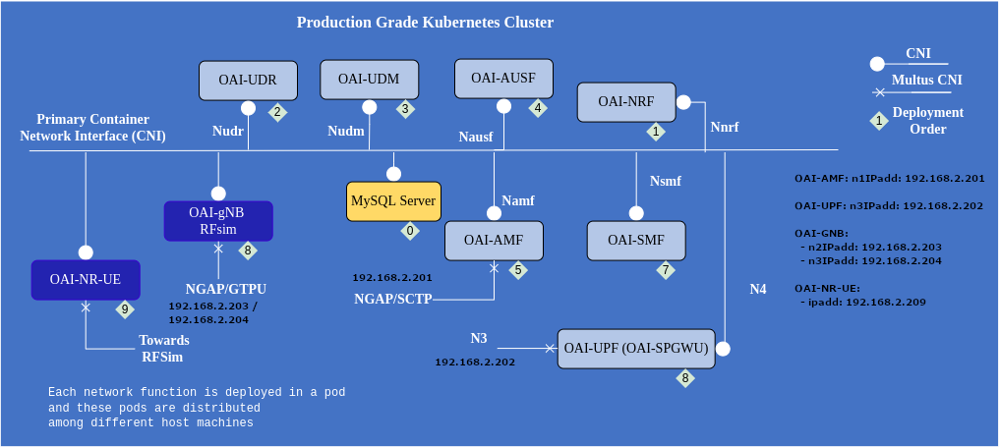

# OAI5G demo on SophiaNode

This example is based on [OAI5G-RFSIM](https://github.com/sopnode/oai5g-rfsim) script that aims to demonstrate how to automate a OAI5G deployment on the SophiaNode cluster using both FIT nodes on R2lab and classical k8s workers. It uses the USRP N300 as a 5G radio device.

In this demo, the **demo-oai.py** nepi-ng script is used to prepare a FIT node that will be used to run the 5G UE emulation while remaining core network and RAN functions are deployed on sopnode servers (sopnode-w2.inria.fr and sopnode.w3.inria.fr).

**Acknowledgments:** _Support regarding configuration of the OAI5G functions has been provided by
Sagar Arora at Eurecom <sagar.arora@eurecom.fr>._

### Software dependencies

Before you can run the script in this directory, you need to install its dependencies

    pip install -r requirements.txt

### Basic usage

all the forms of the script assume there is a deployed kubernetes cluster on the chosen master node, and that the provided slicename holds the current lease on FIT/R2lab.

The mental model is we are dealing with essentially three states:

* (0) initially, the k8s cluster is running and the FIT/R2lab nodes are down;
* (1) after setup, the FIT/R2lab nodes are loaded with the proper image, and have joined the cluster;
* (2) at that point one can use the `--start` option to start the system, which amounts to deploying pods on the k8s cluster;
* (back to 1) it is point one can roll back and come back to the previous state, using the `--stop` option

with none of the `--start/--stop/--cleanup` option the script goes from state 0 to (2),
unless the `--no-auto-start` option is given.

run `demo-oai.py --help` for more details

### References

* [OAI 5G Core Network Deployment using Helm Charts](https://gitlab.eurecom.fr/oai/cn5g/oai-cn5g-fed/-/blob/master/docs/DEPLOY_SA5G_HC.md)
* [R2lab welcome page](https://r2lab.inria.fr/)
* [R2lab run page (requires login)](https://r2lab.inria.fr/run.md)
* [github repo for this page](https://github.com/sopnode/oai5g-rfsim)


## The different steps...

### Metal provisioning

The **demo-oai.py** script optionally deploys a preconfigured Kubernetes (k8s) image on 4 R2lab FIT nodes, which by default are:

* *`fit01`* for oai-amf
* *`fit02`* for oai-spgwu
* *`fit03`* for oai-gnb
* *`fit09`* for oai-nr-ue

Note that all the other OAI5G pods, e.g., oai-smf or oai-spgwu, are launched on the regular k8s worker servers of the SophiaNode platform. 

### Joining the k8s cluster
Then the script will get all the nodes to join the k8s master (*`sopnode-l1.inria.fr`* by default), and configure [k8s Multus](https://github.com/k8snetworkplumbingwg/multus-cni) to use their `data` interface.

### Configuration
After that, the script will deploy OAI5G pods on the k8s cluster. To do that, it will use the k8s worker node that hosts the `oai-amf` pod, which again is *`fit01`* by default.

In a nutshell, the script will clone the OAI5G `oai-cn5g-fed` git repository on the FIT node *fit01*. To do it manually, you will have to run:

```
root@fit01# git clone -b master https://gitlab.eurecom.fr/oai/cn5g/oai-cn5g-fed
```
Then it will apply different patches to configure the various OAI5G pods for the SopNode platform. To do it manually, you will have to run on *fit01* :

```
root@fit01# ./demo-oai.sh configure-all
```

These patches include configuration of Multus CNI interfaces specific to the SophiaNode platform. See the IP address configuration in the following figure modified from the [OAI 5G Core Network Deployment using Helm Charts](https://gitlab.eurecom.fr/oai/cn5g/oai-cn5g-fed/-/blob/master/docs/DEPLOY_SA5G_HC.md) tutorial.



### Deployment

Finally, the **demo-oai.py** script will deploy the OAI5G pods on the k8s cluster. However, if you prefer to do it manually, you will have to do the following directly on *fit01* (or on another k8s worker node or on the k8s master *sopnode-l1*):


```bash
# Wait until all fit nodes are in READY state
sopnode-l1$ kubectl wait node --for=condition=Ready fit01 fit02 fit03 fit09

# Run the OAI 5G Core pods
sopnode-l1$ cd /home/oai/oai-cn5g-fed/charts/oai-5g-core/oai-5g-basic

sopnode-l1$ helm --namespace=oai5g spray .

# Wait until all 5G Core pods are READY
sopnode-l1$ kubectl wait pod -noai5g --for=condition=Ready --all

# Run the oai-gnb pod on fit03
sopnode-l1$ cd /home/oai/oai-cn5g-fed/charts/oai-5g-ran
sopnode-l1$ helm --namespace=oai5g install oai-gnb oai-gnb/

# Wait until the gNB pod is READY
sopnode-l1$ kubectl wait pod -noai5g --for=condition=Ready --all

# Run the oai-nr-ue pod on fit09

# Retrieve the IP address of the gnb pod and set it in chart
#  /home/oai/oai-cn5g-fed/charts/oai-5g-ran/oai-nr-ue/values.yaml

sopnode-l1$ GNB_POD_NAME=$(kubectl -noai5g get pods -l app.kubernetes.io/name=oai-gnb -o jsonpath="{.items[0].metadata.name}")

sopnode-l1$ GNB_POD_IP=$(kubectl -noai5g get pod $GNB_POD_NAME --template '{{.status.podIP}}')

sopnode-l1$ conf_ue_dir="/home/oai/oai-cn5g-fed/charts/oai-5g-ran/oai-nr-ue"
sopnode-l1$ cat > /tmp/gnb-values.sed <<EOF
s|  rfSimulator:.*|  rfSimulator: "${GNB_POD_IP}"|
EOF

# (Over)writing oai-nr-ue chart $conf_ue_dir/values.yaml
sopnode-l1$ cp $conf_ue_dir/values.yaml /tmp/values-orig.yaml
sopnode-l1$ sed -f /tmp/gnb-values.sed < /tmp/values-orig.yaml > /tmp/values.yaml
sopnode-l1$ cp /tmp/values.yaml $conf_ue_dir/

sopnode-l1$ helm --namespace=oai5g install oai-nr-ue oai-nr-ue/

# Wait until the NR-UE pod is READY
sopnode-l1$ kubectl wait pod -noai5g --for=condition=Ready --all

```


### Customization

The **demo-oai.py** nepi-ng script has various options to change default parameters, run ``./demo-oai.py --help`` on your laptop to see all of them.

The main options are:

  * `--no_auto_start` to not launch the OAI5G pods by default.
  * `-s slicename` to provide the slicename that you used to book the platform, which by default is *`inria_sopnode`*.
  * `-k` to not restart the k8s cluster when reconfiguring charts. This will avoid the time consuming leave-join steps for FIT worker nodes.
  * as well as `-i imagename` to use an alternative image name - default is *`kubernetes`*.

For instance, if your slicename is `inria_sc` and you have not yet loaded the k8s images on the FIT nodes, to run all the steps described above, you only have to run the following command on your laptop:

```bash
$ ./demo-oai.py -s inria_sc
```

We added the two following options to be used only when the demo-oai.py script has already run at least once, i.e., when FIT nodes have joined the k8s cluster and OAI5G setup is ready for R2lab:

* `--stop` to remove all OAI5G pods. 
* `--start` to launch again all OAI5G pods with same configuration as before.

The two above steps can also be done directly on *fit01* worker node:

```
root@fit01# ./demo-oai.sh stop
root@fit01# ./demo-oai.sh start
```

Note that the *demo-oai.sh* script allows to start/stop specific part of OAI5G pods using the options *start-cn, start-gnb, start-ue, stop-cn, stop-gnb* and *stop-ue*.

### Testing

At the end of the demo, few logs of the oai-nr-ue pod should be visible on the terminal.

We also run a ping test on the UE to google.fr to verify that the 5G connection is running fine.

To check logs of the different pods, you need first to log on one of the k8s workers or master nodes, e.g., *fit01* or *sopnode-l1.inria.fr*.

For instance, to check the logs of the `oai-gnb` pod, run:

``` bash

root@fit01# GNB_POD_NAME=$(kubectl -noai5g get pods -l app.kubernetes.io/name=oai-gnb -o jsonpath="{.items[0].metadata.name}")

root@fit01# kubectl -noai5g logs $GNB_POD_NAME -c gnb
```

Also, to check logs of the `oai-nr-ue` pod:

``` bash

root@fit01# UE_POD_NAME=$(kubectl -noai5g get pods -l app.kubernetes.io/name=oai-nr-ue -o jsonpath="{.items[0].metadata.name}")

root@fit01# kubectl -noai5g logs $UE_POD_NAME -c nr-ue
```

It is also possible to run the ping test directly on *fit01*:

```
root@fit01# ./demo-oai.sh run-ping
kubectl -noai5g exec -it oai-nr-ue-b794c6777-z8485 -c nr-ue -- /bin/ping --I oaitun_ue1 c4 google.fr
PING google.fr (172.217.22.131) from 12.1.1.81 oaitun_ue1: 56(84) bytes of data.
64 bytes from par21s12-in-f3.1e100.net (172.217.22.131): icmp_seq=1 ttl=112 time=37.3 ms
64 bytes from par21s12-in-f3.1e100.net (172.217.22.131): icmp_seq=2 ttl=112 time=33.1 ms
64 bytes from par21s12-in-f3.1e100.net (172.217.22.131): icmp_seq=3 ttl=112 time=25.5 ms
64 bytes from par21s12-in-f3.1e100.net (172.217.22.131): icmp_seq=4 ttl=112 time=35.3 ms

--- google.fr ping statistics ---
4 packets transmitted, 4 received, 0% packet loss, time 3004ms
rtt min/avg/max/mdev = 25.581/32.838/37.361/4.453 ms
```

Now, assume that you want to restart the demo with some changes in the CN chart configuration, and test it on another namespace, say *oai5g_v2*, the sequence of steps will be:


* Stop the previous test ``` ./demo-oai.py --stop```
* Make your changes on *fit01* in configuration file */root/demo-oai.sh*. (If the CN parameters you want to change are not in script */root/demo-oai.sh*, you can directly change chart file */root/oai-cn5g-fed/charts/oai-5g-core/oai-5g-basic/values.yaml*.) Then run on your laptop:
* ``` ./demo-oai.py --namespace oai5g_v2 -k```

The latter command will take into account your changes to reconfigure the charts, and will then launch the OAI5G pods on the *oai5g_v2* namespace. The "-k" option is used to prevent FIT worker nodes to leave and join the k8s cluster, which takes about 2 minutes to complete...

Note that we don't use "--start" option in this case as this option skips the reconfiguration step. 


### Cleanup

To clean up the demo, you should first remove all OAI5G pods.

For that, you can run on your laptop ``./demo-oai.py --stop`` or run the following command on the k8s cluster:

```bash
root@fit01# helm -n oai5g ls --short --all | xargs -L1 helm -n oai5g delete
```

Another possibility is to run on *fit01*:

```
root@fit01# ./demo-oai.sh stop
```

Then, to shutdown FIT/R2lab worker nodes and remove them from the k8s cluster, run on your laptop the following command:

``` bash
$ ./demo-oai.py --cleanup
```
